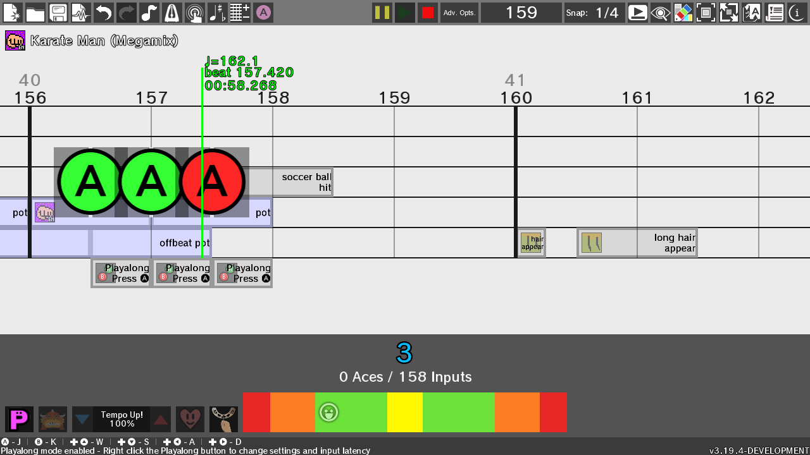

**Before making an issue, please make sure to read the [contributing](.github/CONTRIBUTING.md) file!**

# Rhythm Heaven Remix Editor (RHRE)
A custom remix editor for the [Rhythm Heaven](https://en.wikipedia.org/wiki/Rhythm_Heaven_Megamix) series

### [Download the latest release here!](https://github.com/chrislo27/RhythmHeavenRemixEditor/releases/latest)

**Please read the [README](http://rhre.readthedocs.io/en/latest/README/) after
downloading the program!**

 
Read the [README here](http://rhre.readthedocs.io/en/latest/README/). 
Read the [documentation here](http://rhre.readthedocs.io/en/latest/). 
Check out the [Rhythm Heaven Game Randomizer](https://github.com/chrislo27/RHGR)—a tool to set remixing challenges 
Also see the [RHRE SFX Database Editor](https://github.com/chrislo27/RSDE)—a GUI for editing the RHRE SFX Database 

†

## Requirements
* [A **64-bit** version of Java](https://java.com/en/download/manual.jsp), Java 8 or newer
* A graphics driver that supports OpenGL ES 2.0 or higher
* Windows 7 or newer, or Linux (recommended Ubuntu 20.04 LTS or newer)
  * macOS not officially supported
* An Internet connection to download the SFX Database

## Features

* Drag-and-drop common Rhythm Heaven minigame patterns into your remix
* Change tempo and music volumes easily mid-way through the remix
* Automatic SFX database updating as community fixes/additions get pulled in
* Play the remixes you create using the Playalong function
* Every Rhythm Heaven minigame is here!

## Installation
Installation is straightforward. Please ensure your computer meets the Requirements above.
1. Go [to the most recent release](https://github.com/chrislo27/RhythmHeavenRemixEditor/releases/latest) and download the `RHRE_X.zip` file, where `X` is the current version number.
2. Once downloaded, extract this zip file to a location like the Desktop. On Windows, open the zip file and click Extract. On macOS, use [The Unarchiver](https://theunarchiver.com/) to extract the zip file.
3. Open the extracted folder. Depending on your operating system, run the following file:
  * On Windows: double-click the `run_windows.bat` file
  * On Linux: run the `run_linux.sh` file via Terminal (`./run_linux.sh`)
4. Let the program download the necessary SFX if this is a first boot. You'll see something along the lines of "Receiving objects" while it loads. This may take several minutes.
5. Read the [README](http://rhre.readthedocs.io/en/latest/README/) and get remixing!

## Updating the program
From **v3.20.0 and newer**: To update the program, click the "Download and install update" button when the program greets you with the prompt. You can also check for updates manually in the Info and Settings screen, or update manually using the instructions below. 
From **v3.19.5 and earlier**: To update the program, [download the latest version](https://github.com/chrislo27/RhythmHeavenRemixEditor/releases/latest) and run RHRE from the new version. 

## Other information
Rhythm Heaven is not my property—it is the intellectual property of Nintendo. 
This program is **NOT** endorsed nor sponsored in any way by Nintendo. 
All used properties of Nintendo (such as names, audio, graphics, etc.) in this software are not intended to maliciously infringe trademark rights. 
All other trademarks and assets are property of their respective owners.
This is a community project and this is available for others to use
however they like while abiding by the code's GPL-3.0 license, without charge.

For the repository holding RHRE version v0.1.0-alpha to v0.4.4-alpha (collectively known as RHRE0), go to <https://github.com/chrislo27/RHRE0>.

† Donations are only made to the project maintainer, [@chrislo27](https://github.com/chrislo27).

Features screenshots provided by: [dexiedoo](https://www.youtube.com/channel/UC_ckCtLt88aI8Qzz5VM3UwA).
