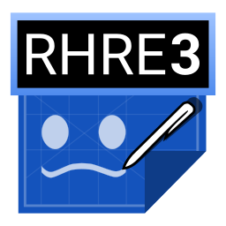

**Before making an issue, please make sure to read the [contributing](.github/CONTRIBUTING.md) file!**

# Rhythm Heaven Remix Editor 3
An audio remix editor for the Rhythm Heaven series

Get a download from the [Releases tab](https://github.com/chrislo27/RhythmHeavenRemixEditor/releases). 
Read the [README here](http://rhre.readthedocs.io/en/latest/README/). 
Read the [documentation here](http://rhre.readthedocs.io/en/latest/). 
Check out the [Rhythm Heaven Game Randomizer](https://github.com/chrislo27/RHGR) -- a tool to set remixing challenges 

## Requirements
* [Java 8](https://java.com/en/download/)
  * Java 9 and 10 not fully supported at the moment -- use at own risk
* A graphics driver that supports OpenGL 2.0 or higher
* An Internet connection initially

Rhythm Heaven is not my property -- it is the property of Nintendo. 
All used properties of Nintendo (such as names, audio, graphics, etc.) in this software are not intended to infringe trademark rights. 
This is just a community project and this is available for others to use
however they like (abiding by the code's GPL-3.0 license).

RHRE3 logo designed by [GlitchyPSIX](https://www.youtube.com/user/supermarioglitchy33/).
