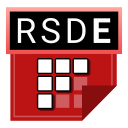

# JSON Object Definitions for Databasing

All the sounds and patterns in RHRE are defined in a `data.json` file in each game's folder.<br>
If you're looking for the specifics of modding metadata introduced in v3.17.0, [see this article](Modding-metadata.md) instead.

## RSDE
[](https://github.com/chrislo27/RSDE)
<br>
Please use the [RHRE SFX Database Editor](https://github.com/chrislo27/RSDE) to edit the SFX Database.
It comes with error checking and is significantly more easy-to-use than editing a JSON file by hand.

## ID rules
IDs must only consist of ASCII alphanumerics, hyphens `-`, forward slashes `/` (not game IDs), and underscores `_`.

**Game** type IDs are always just `lowerCamelCase`. They **cannot** have forward slashes.
**Cue** type IDs are `gameID/filename`.
**Pattern** type IDs are `gameID_id`.

Examples:<br>
`coolGame` - Name of the game<br>
`coolGame/buzzer` - A sound in the `coolGame` folder named `buzzer`<br>
`coolGame_pattern` - A pattern for `coolGame`

### Shortened IDs (*-substitution)
Writing out the game ID prefix over and over for your cues is quite annoying.
That's why there's a shorthand syntax to substitute the current game's ID in, called
*-substitution (star-substitution). Every instance of an asterisk `*` will be replaced with the parent game's ID.

The only IDs that are star-substitutable are cue/pattern IDs, response IDs, and IDs used in `CuePointerObjects`.

Examples (`coolGame` is the game ID):<br>
`coolGame/buzzer` should be shortened to `*/buzzer`<br>
`coolGame_pattern` should be shortered to `*_pattern`<br>

Note that this only works in the same `GameObject` the star-ID is in. If you're referring to
other cues or patterns NOT from this same GameObject, you must put its full ID.

### Language suffixes
Some games may be language-specific. You should use the correct icon overlay in
the `example/` folder in the SFX Database, and use the following table for language suffixes (capitalize the first letter when necessary):

| Language | Suffix |
|---|---|
| English | `en` |
| Japanese | `ja` |
| Korean | `ko` |
| Spanish | `es` |
| French | `fr` |
| Italian | `it` |
| German | `de` |

### A note on deprecated IDs
`deprecatedIDs` is an array of old IDs that are no longer used, but refer
to this current object for older save files. You will see them frequently.

## Data types
There are several data types available to you to use. Each field
has a specific data type that cannot be swapped with another.

All types **cannot** be `null` unless otherwise stated.

>Note: In the following tables for the object types, you may see a question mark (?)
at the end of the name. Ex: (`string?`, `number?`) This means that the field is optional, and doesn't have to be included if it's not necessary.

| Name | Syntax | Example | Purpose |
|------|--------|---------|---|
| string | "<stuff>" | "hello" | Text |
| boolean | `true` or `false` | `true` | To indicate truth values |
| number | digits of 0-9, decimals allowed | 1.0 | Numbers that can have decimals |
| integer | digits 0-9, no decimals | 150 | Non-decimal numbers |
| array | `[]` | `["first", "second", "third"]` | A "list" of other types |
| id | same as string | "spaceDanceEn" | A unique identifer for this object, see ID rules above |

## `GameObject` structure
All `data.json` files for each game are a `GameObject`.

```json
{
  "id": "lowerCamelCaseID",
  "name": "Human-Readable Name",
  "objects": [],
  "series": "tengoku",
  // optional fields after this comment
  "group": "Human-Readable Name",
  "groupDefault": false,
  "priority": 0,
  "searchHints": [],
  "noDisplay": false
}
```

| Field | Type | Description |
|---|---|---|
| id | id | Game type ID |
| name | string | Name of game (see below for specific info) |
| objects | array of objects | Objects like cues, patterns, etc. |
| group | string? | Name of game without language/game info (see below) |
| groupDefault | boolean? | Whether this game is the first to show in its group |
| priority | integer? | Priority for sorting games in the picker. Higher numbers are earlier, lower numbers are later (can be negative). |
| searchHints | (array of strings)? | Other tags to search this game by in the picker. Optional, defaults to empty array. |
| noDisplay | boolean? | Whether to ignore this game in game sections/presentation mode (default false) |

The `name` field is a properly Title Case capitalized name. This is in English.
If this game appears in multiple series, for example both in RHDS and Megamix,
the name of the series used should be in parentheses after the name of the game.
Use official game name titles wherever possible; use fan-translated names as a last resort.<br>
Example of series: `Space Dance (Megamix)` and `Space Dance (GBA)`.<br>
Example of using official game titles: instead of `Cosmo Dance`, use `Cosmic Dance`

Series' names:

| Game | Suffix |
|---|---|
| Rhythm Tengoku | (GBA) |
| Rhythm Heaven | (DS) |
| Rhythm Heaven Fever | (Fever) |
| Rhythm Heaven Megamix | (Megamix) |

The `objects` array is an array of various object types, which will be
explained below. It is **very important** that each object definition contain
the `type` field, which is used to determine the object's type.

The `series` field is a string showing what series this game belongs to.<br>
>Note: if this is not present it defaults to "other".

| Series | Field Value |
|-------------|------------|
| Other | `other` |
| GBA | `tengoku` |
| DS | `ds` |
| Fever | `fever` |
| Megamix | `megamix` |
| Side | `side` |

The optional `group` field is the full name of the group this data object
belongs to, if it has variants. For example, `gleeClubEnMegamix` would
have the group value be `Glee Club (Megamix)` to be grouped with other
data objects that also have the same group value. Games with `groupDefault`
set to true will appear earlier in the variant list.

#### Reserved Game IDs
The IDs below are reserved and cannot be overwritten.

| ID | Name | Since |
|----|------|-------|
| `special` | Special Entities | v3.0.0 |
| `specialPlayalong` | Playalong Input Entities | v3.17.0 |

## `CuePointerObject` structure
```json
{
  "id": "cueID",
  "beat": 1.0,
  // optional fields after this comment
  "duration": 1.0,
  "track": 0,
  "semitone": 0,
  "volume": 100,
  "metadata": {}
}
```

`CuePointerObject` is used to store extra data like pitch for creating entities.
You will find them in multipart objects such as patterns.

| Field | Type | Description |
|---|---|---|
| id | string | String ID pointing to object |
| beat | number | The beat this cue will appear at |
| duration | number? | If present, overrides the duration of the cue with this value |
| track | integer? | Indicates how many tracks up/down (up is positive) to put this cue |
| semitone | integer? | Number of semitones to pitch up/down |
| volume | integer? | 0-300 value of a percentage volume. Default 100. Cannot be negative. |
| metadata | map? | Extra key/value data (see below) |

**Note that** the only fields shown here ARE the ones it has, but
not every field from `CueObject` may be used depending on the situation.

The `metadata` object is optional, and acts as a key/value map.<br>
Below is a list of potential properties:

| Entity Type | Field Name | Field Type | Field Values |
|-------------|------------|------------|--------------|
| `subtitleEntity` | `subtitleText` | `string` | &lt;user-defined&gt; |

Example:<br>
```json
"metadata": {
  "subtitleText": "Predefined subtitle text!"
}
```

## `CueObject` structure
```json
{
  "type": "cue",
  "id": "*/lowerCamelCaseID",
  "deprecatedIDs": [],
  "name": "human-readable cue name",
  "duration": 1.0,
  // optional fields after this comment
  "stretchable": false,
  "repitchable": false,
  "fileExtension": "ogg",
  "loops": false,
  "baseBpm": 120.0,
  "earliness": 0.05,

  "introSound": "other/ID",
  "endingSound": "other/ID2",

  "responseIDs": []
}
```

A `CueObject` defines a sound to be loaded by the editor. It also contains
metadata such as the duration and its editable abilities.

| Field | Type | Description |
|---|---|---|
| type | string | Always "cue" |
| id | id | Cue type ID |
| deprecatedIDs | array of IDs | Old, defunct IDs that this object used to have (backwards compatibility) |
| name | string | Human-readable name |
| duration | number | Duration of this cue in beats |
| stretchable | boolean? | If true, the cue can be dragged longer or shorter |
| repitchable | boolean? | If true, the cue can have its pitch changed by the user |
| fileExtension | string? | File extension of the cue sound file. You should generally always use OGG Vorbis files, so you shouldn't have to use this field. |
| loops | boolean? | If true, this cue loops its sound. |
| baseBpm | number?| If present, this cue will get repitched automatically based on the tempo. See below for more info. Must be greater than zero if present.|
| introSound | id?| If present, will play this other sound at the start of the cue. See below for more info. |
| endingSound | id?| If present, will play this other sound at the end of the cue. See below for more info. |
| responseIDs | (array of IDs)? | If present, these IDs will be used for response-copying. See below for more info. |
| earliness | number? | If present, indicates the number of seconds **early** to play this cue. Useful for voiced cues where certain syllables start earlier. Negative values should not be used. Defaults to 0.0. |

The `id` field is structured like this: `dataObjectID/lowerCamelCaseSoundFileName`.
If the parent data object's ID is `spaceDance`, and this sound's name is `turnRight`,
therefore this ID is `spaceDance/turnRight`. If there are more folders, you
should include them in the path separated by more forward slashes. Example:
`flipperFlop/appreciation/nice` is the sound file `nice.ogg` inside the folder `appreciation/`
which has a parent folder of `flipperFlop`.

The `name` field is a name. This is in English, except for the
romanization/latinization of foreign language words. Avoid capitals. The only
time you should be using capitals are for the following: proper noun I,
"Remix X", "Fever" (in the context of the game).
If this is syllabic (part of a longer sound cue), you should add a hyphen with
spaces surrounding it to break up words. The program will automatically convert these
into newlines. **Do not use newline characters.**<br>
Example (First Contact): `alien - 1`, `alien - 2`, etc.

The `introSound` and `endingSound` fields are optional string IDs to indicate
sounds that should be played at the beginning and end of the main sound cue,
respectively. Cues that are either intro or ending sounds will not be pickable.
These are useful for cues like Glee Club, where there is an intro singing sound,
and an ending sound (mouth shut).

The `responseIDs` array is an array of possible "response" sound IDs for
use with the response-copying. Useful for copy-and-response games.

If `baseBpm` is used, the sound effect will be pitched
accordingly during playback based on the current tempo relative to the value
set in `baseBpm`. Example: When playing at 180 BPM and the base BPM is 120, the sound effect will be sped up by 1.5x.

## `PatternObject` structure
```json
{
  "type": "pattern",
  "id": "*_lowerCamelCaseID",
  "deprecatedIDs": [],
  "name": "human-readable pattern name",
  "cues": [ // array of CuePointerObjects
    {
      // see CuePointerObject
    }
  ],
  // optional fields after this comment
  "stretchable": false
}
```

A `PatternObject` is a series of cues bundled together. They contain default
settings for each cue, such as its position (in beats and track number), its
pitch adjustment (`semitone`), and `duration` (defaults to original duration).

| Field | Type | Description |
|---|---|---|
| type | string | Always "pattern" |
| id | id | Pattern type ID |
| deprecatedIDs | array of IDs | Old, defunct IDs that this object used to have (backwards compatibility) |
| name | string | Human-readable name |
| cues | array of CuePointerObjects | The cues for this pattern |
| stretchable | boolean? | If true, the pattern can be dragged longer or shorter |

The array of `CuePointerObject`s uses the standard cue pointer object fields.

## `EquidistantObject` structure

```json
{
  "type": "equidistant",
  "id": "*_lowerCamelCaseID",
  "deprecatedIDs": [],
  "name": "human-readable name",
  "distance": 1.0,
  "stretchable": false,
  "cues": [ // ORDERED array of CuePointerObjects
    {
      // see CuePointerObject
      // "beat" and  "duration" fields are NOT used
    }
  ]
}
```

The `EquidistantObject` represents a pattern where each cue is
*equidistant* from each other. That is to say, if the `distance` is 2.0
beats, each cue will be 2.0 beats apart based on left endpoints.
The `stretchable` field indicates if this entity is stretchable or not (ex: Bouncy Road).

| Field | Type | Description |
|---|---|---|
| type | string | Always "equidistant" |
| id | id | Pattern type ID |
| deprecatedIDs | array of IDs | Old, defunct IDs that this object used to have (backwards compatibility) |
| name | string | Human-readable name |
| distance | number | Distance between each internal cue. Must be positive. |
| stretchable | boolean | If true, the pattern can be dragged longer or shorter |
| cues | array of CuePointerObjects | The cues for this pattern |

Examples of games with equidistant objects: Bouncy Road, Sneaky Spirits, Built to Scale (DS)

The `CuePointerObjects` used are *ordered* and do **NOT** use the `beat` and `duration` fields.

## `KeepTheBeatObject` structure

```json
{
  "type": "keepTheBeat",
  "id": "*_lowerCamelCaseID",
  "deprecatedIDs": [],
  "name": "human-readable name",
  "defaultDuration": 2.0,
  "cues": [ // ORDERED array of CuePointerObjects
    {
      // see CuePointerObject
    }
  ]
}
```

The `KeepTheBeatObject` is similar to the `EquidistantObject`, but it
repeats over and over. This is for things like
Lockstep marching patterns, or Flipper-Flop, but is not limited to
same-beat patterns. This is a type of pattern that can repeat itself.

| Field | Type | Description |
|---|---|---|
| type | string | Always "keepTheBeat" |
| id | id | Pattern type ID |
| deprecatedIDs | array of IDs | Old, defunct IDs that this object used to have (backwards compatibility) |
| name | string | Human-readable name |
| defaultDuration | number | Minimum duration when initially placed. Must be positive. See below for more info. |
| cues | array of CuePointerObjects | The cues for this pattern |

Examples of games with keep-the-beat objects: Lockstep, Tap Troupe, Flipper-Flop, Rhythm Rally

The `defaultDuration` field is the duration when initially placed. It also
acts as the interval for when to repeat the pattern in `cues`.

>Note, if the total duration of `cues` is longer than `defaultDuration`, the repeating interval will be this longer value.

The `CuePointerObjects` used are *ordered*.

## `RandomCueObject` structure

```json
{
  "type": "randomCue",
  "id": "*_lowerCamelCaseID",
  "deprecatedIDs": [],
  "name": "human-readable name, usually 'random X'",
  "cues": [ // array of CuePointerObjects
    {
      // see CuePointerObject
      // "beat" field ignored
    }
  ],
  // optional fields after this comment
  "responseIDs": []
}
```

The `RandomCueObject` is like a pattern except it only chooses one of the
objects in the `cues` array at random **when played**.

| Field | Type | Description |
|---|---|---|
| type | string | Always "randomCue" |
| id | id | Pattern type ID |
| deprecatedIDs | array of IDs | Old, defunct IDs that this object used to have (backwards compatibility) |
| name | string | Human-readable name |
| cues | array of CuePointerObjects | The possible cues to use |
| responseIDs | (array of IDs)? | If present, this can be response-copied. See `CueObject` for more info. |

You are not limited to just using `CueObjects` in the `cues` array.

Examples of games with random cue objects: Ringside (has variants), First Contact (speech sounds)

The `CuePointerObject` is unchanged, but the `beat` field is not used.
