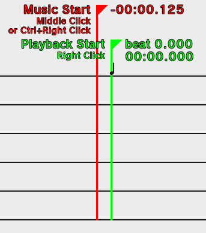
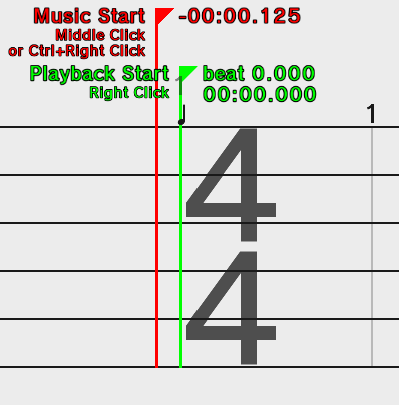

# Starting a remix

Here are a few simple steps to start out with each time you start a new custom remix.

## 1. Picking music
 
To load music, the button on the left side of the toolbar that looks like
a music note. You can load in mp3, ogg, and wav files. It is recommended
to use the ogg file format to reduce save file size.

## 2. Getting the tempo
 
Most songs have only one tempo.

First, set an *initial* tempo using the Tempo Change tool (press **`3`**)
and clicking at beat zero. This will let you play the remix, but you're going
to change this value later.

Click the button with a hand touching ripples
to open the Tapalong menu. Play the remix, and start pressing **`T`**
to tap along. The predicted tempo will be shown below. You should aim
for around 50 or more inputs to get a reliable average.

Set your found tempo by first pressing **`HOME`** to jump back to beat zero,
selecting the Tempo Change tool again, and scrolling while hovering on the initial tempo change.

## 3. Moving the music start tracker
This is a **very important** step. Your remix will *probably be offbeat*
(even with the right tempo!) if you do not set this.

Most songs will have a slight gap of silence at the start, or the beat
in the song will not match the beats in the editor. You have to correct
this by moving the music start tracker *backwards*.

Starting with v3.18.0, the program will try to guess where the start of
music is. Use the button in the Music Start screen to set it.
To do it manually, move the tracker by middle clicking or pressing `CTRL+RCLICK` in the track.
If it doesn't work, make sure you are using the Selection tool (press **`1`**).
To get more precision, click the Snap setting (will look like 1/4) to increase
the fineness of movement.

You can use trial-and-error to correct it, or open up a program that
allows you to view the waveform like Audacity. To test it,
enable the Metronome (in the toolbar) and listen to the remix. If the
clicks line up to the song, you're good to go! Otherwise, keep fiddling
with the music start tracker.

>Above: The metronome button.

>Above: An example of moving the music start tracker.
The tracker has been moved back 0.125 seconds.
This accounts for 0.125 seconds of silence at the start of the song.

## 4. Setting a time signature
Time signature is very important in music as it groups together certain beat
intervals. Likewise, the use of measures in Rhythm Heaven is very important,
as certain songs only work in certain time signatures, or only fit in
certain beats of a time signature.

>Note: RHRE3 only supports time signatures with denominators 2, 4, 8, and 16 (half, quarter, eighth, and sixteenth notes respectively).

The most common time signature is 4/4 time. Other songs (like waltzes)
are in 3/4. Figuring out the time signature of a piece of music is
beyond the scope of this article, but generally most songs are in 4/4.

Set a time signature by selecting the Time Signature tool (press `5`),
clicking at a whole number beat, and setting the number of quarter notes
per measure by scrolling.

Test playback with the Metronome once again,
and you'll hear a higher pitched click at the start of a measure.
If the higher-pitched clicks go with the song (for example, lyrical
songs tend to have sets of lyrics that start at a measure), you're set.

Note that some games work in certain time signatures only. For example,
Micro-Row's and Monkey Watch's main inputs only fall on the offbeats
of a 4/4 time signature (1 **2** 3 **4**). Most call-and-response games
(excluding Wizard Waltz) operate in a 4/4 time signature.

## 5. Add cues
Now you've come to the creative part -- adding the patterns and cues.
One of the few things to keep in mind is to make it realistic and to
strive to make it [playable](Playalong.md). Imagine if you were presented with playing
your remix -- would it be possible? Would it be followable with the rhythm?
Many of these aspects are key to what makes a remix sound good.

## (Optional) 6. Playalong cues
Starting with v3.17.0, you can add Playalong cues to actually add inputs
to your remix. More info [in its separate doc page.](Playalong.md)

Happy remixing!